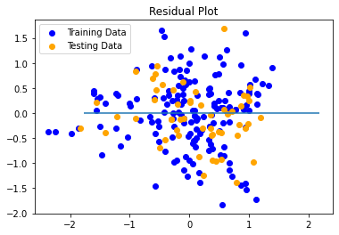

# Machine Learning Nice Ride Bike Sharing

## Background: 
Our group used machine learning to predict the number of bikes that are rented each day based on a number of inputs. Bike-Sharing has become increasingly popular in major cities. Here in the twin cities, we have the bike-sharing nonprofit Nice Ride MN. We want to analyze these data to draw some insights and help the Nice Ride to make better business decisions

* A linear regression model that predicts the daily bike transaction based on daily weather inputs. 
* A logistic regression model to classify whether daily bike use is above or below the average for the year. 
* Analyzed the station demand to determine if adequate docks are provided at each station, does it has a seasonal demand change, and etc. 

## Data Source
Climate data comes from National Oceanic and Atmospheric Administration,  OpenWeatherMap, Kaggle, and also open data shared by the company Nice Ride MN. 

## Tools and Languages

- Python
    * Scikit-learn
    * Pandas
    * Matplotlib
    * Sqlalchemy
    * Statsmodels

- HTML
- CSS
- Tableau

## Analysis

#### Setup Dependencies and Connect to Database

      # Python SQL toolkit and Object Relational Mapper
      import numpy as np
      import pandas as pd
      import sqlalchemy
      from sqlalchemy.ext.automap import automap_base
      from sqlalchemy.orm import Session
      from sqlalchemy import create_engine, func,inspect
      from config import pgkey
      from sklearn.neighbors import KNeighborsClassifier
      import os
      
      # Connect to PostgreSQL database
      con_string = f"sqlite:///../Data/Final_Project_DB.db"
      engine = create_engine(con_string)
      connection = engine.connect()
      
      # reflect an existing database into a new model
      Base = automap_base()
      # reflect the tables
      Base.prepare(engine, reflect = True
      
      # Save references to each table
      station_df = Base.classes.station_location
      weather_df = Base.classes.weather_data
      bike_df = Base.classes.bike_transaction
      humidity_df = Base.classes.humidity
      wind_speed_df = Base.classes.wind_speed
      pressure_df = Base.classes.pressure
      
      # Create our session (link) from Python to the DB
      session = Session(engine)
      # Create the inspector and connect it to the engine
      inspector = inspect(engine)
      
#### Query data and transfrom into pandas dataframes

      # Query all bike transaction data 
      bike_info = session.query(
          bike_df.id,
          bike_df.start_date,
          bike_df.start_time,
          bike_df.start_station_name,
          bike_df.start_station_code,
          bike_df.end_date,
          bike_df.end_time,
          bike_df.end_station_name,
          bike_df.end_station_code,
          bike_df.user_type,
          bike_df.total_duration
      ).all()

      session.close()

      # Convert query results to DataFrame
      bikes_df = pd.DataFrame(bike_info)
      bikes_df['start_date'] = pd.to_datetime(bikes_df['start_date'])
      bikes_df['end_date'] = pd.to_datetime(bikes_df['end_date'])
      
#### Clean and Transform the data

For each of the models, calculations of the total daily rides, avg daily rides, and station demand were calculated and added to the data frames.  The date columns were converted into Datetime format using pd.to_datetime

#### Logistic Regression Model

Using SKLearn, a logistic model was created to predict the demand for bike use based on the days weather.  The data was categorized as either above or below average demand.  Then using train_test_split, the data was split into train and test data to create the model. 
The model had an accuracy score of 85%.

      from sklearn.model_selection import train_test_split

      X_train, X_test, y_train, y_test = train_test_split(Bikes_test_data, target, random_state=0)
      
      # Fit the model and calculate scores
      classifier.fit(X_train, y_train)
      
      print(f"Training Data Score: {classifier.score(X_train, y_train)}")
      print(f"Testing Data Score: {classifier.score(X_test, y_test)}")

The Minneapolis weather forecast API was then used to obtain the weather forecast for the week. The parameters were entered into the model to predict bike use for the incoming week.

#### Linear Regression Model

Using Nice Ride 2017 bike data and 2017 weather data, a Linear Regression model was created to predict the daily bike use based on daily weather patterns. The linear regression model returned an R2 coefficient of 0.663 and a MSE of 0.331.

	# Normalize the Data
	from sklearn.preprocessing import StandardScaler
        x_scaler = StandardScaler().fit(x_train)
        y_scaler = StandardScaler().fit(y_train)
        x_train_scaled = x_scaler.transform(x_train)
        x_test_scaled = x_scaler.transform(x_test)
        y_train_scaled = y_scaler.transform(y_train)
        y_test_scaled = y_scaler.transform(y_test)

	# Plot the results
	from sklearn.linear_model import LinearRegression
        model = LinearRegression()
        model.fit(x_train_scaled, y_train_scaled)
        plt.scatter(model.predict(x_train_scaled), model.predict(x_train_scaled) - y_train_scaled, c="blue", label="Training Data")
        plt.scatter(model.predict(x_test_scaled), model.predict(x_test_scaled) - y_test_scaled, c="orange", label="Testing Data")
        plt.legend()
        plt.hlines(y=0, xmin=y_test_scaled.min(), xmax=y_test_scaled.max())
        plt.title("Residual Plot")
        plt.show()

	# Quanitfy the model using the scaled data
	from sklearn.metrics import mean_squared_error
        predictions = model.predict(x_test_scaled)
        MSE = mean_squared_error(y_test_scaled, predictions)
        r2 = model.score(x_test_scaled, y_test_scaled)
        print(f"MSE: {MSE}, R2: {r2}")

#### Station Demand Analysis

The demand per station was analyzed to determine if adequate docks are provided at each location to meet demand. Coffman Union and Lake Street & Knox Ave S are the top two stations with high demand.

	# Calculate Demand Difference: Inbound vs. Outbound Trips
	sdf['demand_diff'] = sdf['Inbound trips']-sdf['Outbound trips']
        plt.figure()
        plt.hist(sdf['demand_diff'], bins=20, color = '#1989c8')
        plt.ylabel('# of Stations')
        plt.xlabel('# Inbound - # Outbound Trips')
        plt.title('Demand Difference')
        plt.show()

	# Dock availability
	sdf['abslt_diff'] = sdf['demand_diff'].abs()
        #dock availability vs demand difference
        sdf['Docks'] = sdf['Total docks']/sdf['Total docks'].sum()
        sdf['DemandDiff'] = sdf['abslt_diff']/sdf['abslt_diff'].sum()
        seaborn_data_cleaned = (
        sdf[['Name', 'Docks', 'DemandDiff']].set_index('Name').stack().reset_index()
        	.rename(columns={'level_1':'Distribution', 0:'Proportion'}))
        #graph
        plt.figure(figsize=(8, 50))
        station_list = (sdf.sort_values('DemandDiff', ascending=False)['Name'].tolist())
        sns.barplot(y='Name', x='Proportion', hue='Distribution', 
        data=seaborn_data_cleaned, order=station_list, color = '#1989c8')
        plt.title('Dock Availability vs Demand Difference')
        plt.show()

